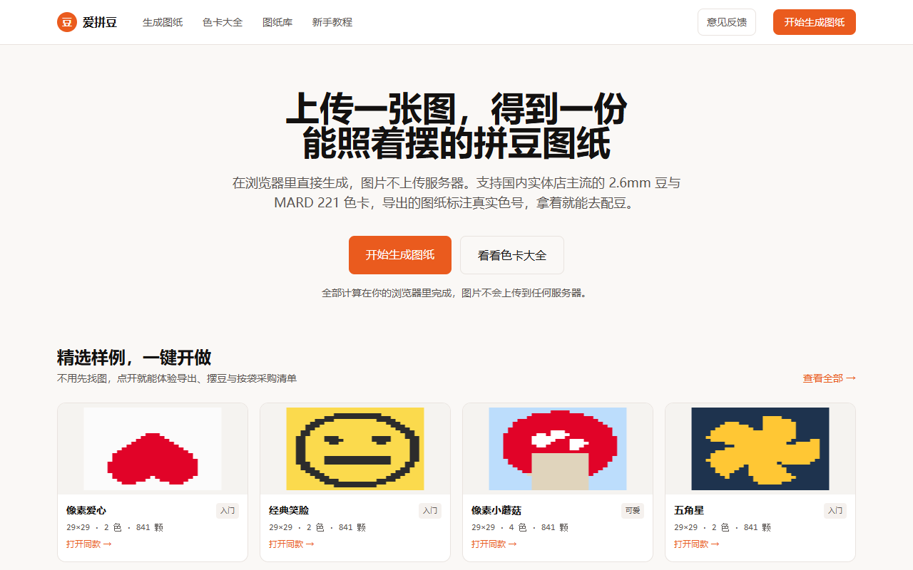
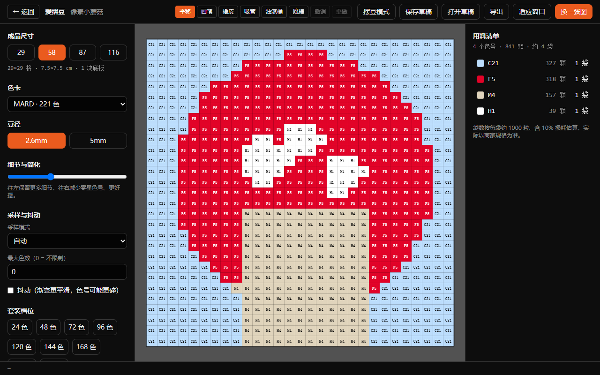
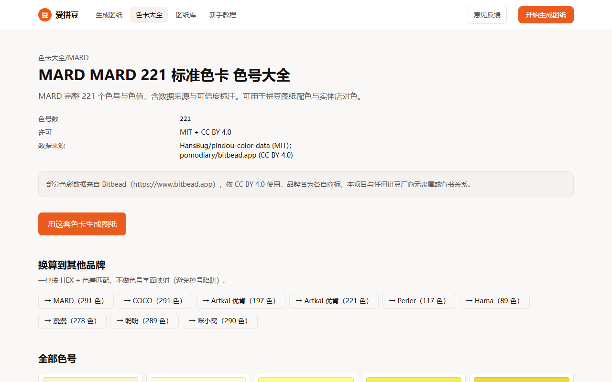
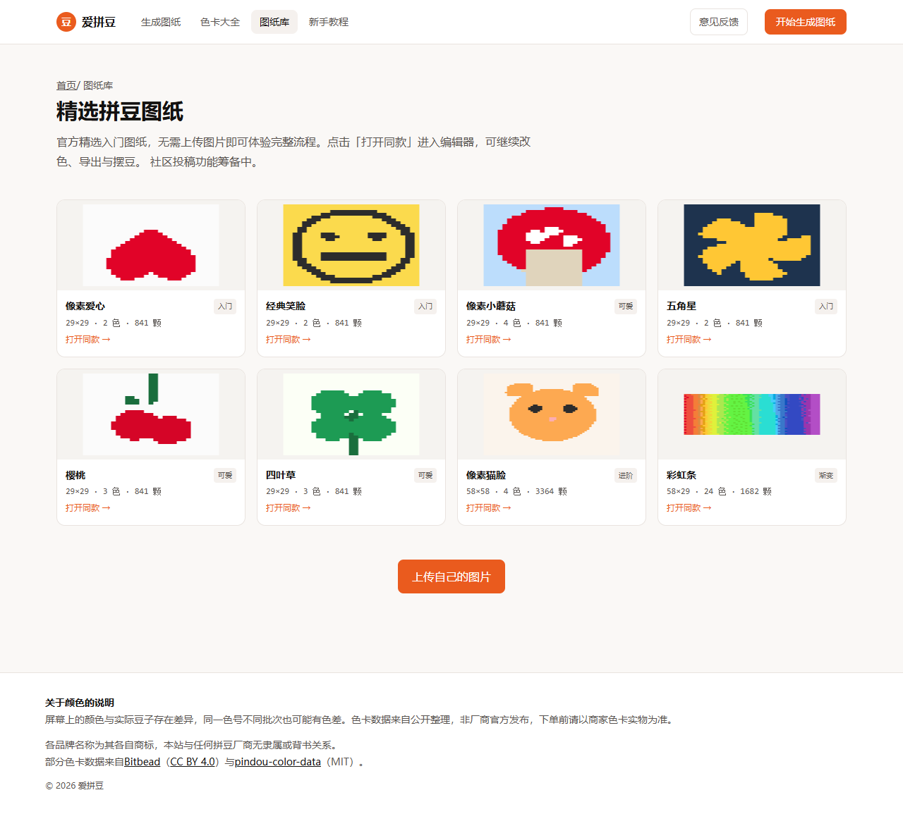

# 爱拼豆 · AiPindou

> 把图片变成能照着摆的拼豆图纸 —— 纯浏览器运行，无需登录，图片不上传服务器。

**在线演示**：https://ai-pindou.aipindou.workers.dev

[](LICENSE)
[](https://nodejs.org/)
[](https://pnpm.io/)
[](https://ai-pindou.aipindou.workers.dev/)

面向中文拼豆场景：**默认 2.6mm 豆径 + MARD 221 色卡**（国内线下店与电商主流配置），而非国际工具常见的 5mm 默认值。

## 界面预览

<p align="center">
  <a href="https://ai-pindou.aipindou.workers.dev/">
    
  </a>
  <br />
  <sub>首页 — 上传图片即可生成，计算全在浏览器本地完成</sub>
</p>

<table>
  <tr>
    <td width="50%" align="center">
      <a href="https://ai-pindou.aipindou.workers.dev/editor/?sample=mushroom-29">
        
      </a>
      <br />
      <sub>编辑器 — 样例一键开做，导出 PNG / PDF / CSV</sub>
    </td>
    <td width="50%" align="center">
      <a href="https://ai-pindou.aipindou.workers.dev/palette/mard-221/">
        
      </a>
      <br />
      <sub>色卡详情 — 221 色 + 跨品牌换算</sub>
    </td>
  </tr>
  <tr>
    <td colspan="2" align="center">
      <a href="https://ai-pindou.aipindou.workers.dev/patterns/">
        
      </a>
      <br />
      <sub>图纸库 — 8 个精选静态样例，无需上传即可体验</sub>
    </td>
  </tr>
</table>

---

## 功能一览

| 模块 | 能力 |
| --- | --- |
| **图片转图纸** | 上传 / 拖拽 / 粘贴；裁剪；去背景；抖动；限色；碎色合并 |
| **色卡与约束** | 10 套品牌色卡；套装档位引导；「我的色板」勾选/导入；生成阶段即限定可用色 |
| **编辑** | 画笔、橡皮、吸管、油漆桶、魔棒；撤销/重做；缺色分析与替换建议 |
| **制作辅助** | 摆豆进度追踪；镜像预览；底板辅助线（10 / 29 / 52 格） |
| **导出** | PNG / PDF（含 1cm 校准条与分板提示）/ CSV 按袋采购清单 |
| **样例与 SEO** | 8 个精选静态样例；色卡详情与跨品牌换算页；豆径规格落地页 |

算法在 **Web Worker** 中运行，核心引擎零 DOM 依赖，可在 Node 下独立测试。

---

## 快速开始

### 在线体验

无需安装，直接打开：**https://ai-pindou.aipindou.workers.dev**

### 本地开发

#### 环境

- **Node.js ≥ 22.12**（Astro 7 要求）
- **pnpm 9**

```bash
git clone https://github.com/JackXhl/ai-pindou.git
cd ai-pindou
pnpm install
cp .env.example .env    # 按需修改 PUBLIC_SITE_URL
pnpm dev
```

浏览器打开 [http://localhost:4321/aipindou/](http://localhost:4321/aipindou/) 。

### 常用命令

| 命令 | 说明 |
| --- | --- |
| `pnpm dev` | 开发服务器 |
| `pnpm build` | 构建静态站到 `apps/web/dist` |
| `pnpm check` | 门禁：色卡校验 → 类型检查 → 单测 → 构建 |
| `pnpm test` | 运行单测 |
| `pnpm verify:data` | 只校验色卡数据 |
| `pnpm refresh:palettes` | 从上游重建色卡 JSON |
| `pnpm generate:samples` | 重新生成 `public/samples/` 样例 |

提交前请跑通 `pnpm check`。

---

## 项目结构

```
ai-pindou/
├── apps/web/              Astro 静态站 + Vue 编辑器 island
├── packages/
│   ├── core/              图纸生成引擎（CIEDE2000、量化、BOM）
│   └── registry/          色卡与豆径规格数据
├── scripts/               样例生成等工具脚本
├── deploy/                部署手册（Nginx / Cloudflare）
└── assets/                README 等公开静态资源
```

依赖方向严格单向：`web → core → registry`。

---

## 文档

| 文档 | 说明 |
| --- | --- |
| [deploy/cloudflare-pages.md](./deploy/cloudflare-pages.md) | **Cloudflare 免费托管**（Pages / Workers Builds） |
| [deploy/README.md](./deploy/README.md) | 自有服务器部署（Nginx + Cloudflare CDN） |
| [packages/registry/PALETTE-MAINTENANCE.md](./packages/registry/PALETTE-MAINTENANCE.md) | 色卡数据更新规范（贡献者） |

---

## 架构原则（贡献者必读）

以下为刻意约束，改代码前请先读一遍：

1. **可用色是匹配阶段的输入域** — `generate()` 接收 `availableColors`，不能「先全色板匹配再事后替换」。
2. **站内 URL 只由 `apps/web/src/lib/url.ts` 构造** — 避免部署前缀 / 尾斜杠 / 语言前缀拼错导致线上 404。
3. **色卡数据不猜测填充** — 无法确认的色号标 `unidentified`；套装分档只登记「档位存在」。
4. **`Uint16Array` 用 `shallowRef` + `markRaw`** — 避免 Vue 深度代理拖垮画布帧率。
5. **core 不含品牌名与豆径字面量** — 差异通过 `CraftSpec` 数据传入。

---

## 色卡数据与署名

色卡来自公开数据源交叉比对，**非厂商官方发布**。每个色号带 `confidence` 与 `sources`，跨品牌换算只走 HEX + ΔE，**不按色号字面对照**。

| 来源 | 许可 |
| --- | --- |
| [pindou-color-data](https://github.com/HansBug/pindou-color-data) | MIT |
| [Bitbead](https://www.bitbead.app) | CC BY 4.0（产品页脚已署名） |

各品牌名称为其各自商标；本项目与任何拼豆厂商无隶属或背书关系。

---

## 参与贡献

欢迎 Issue 与 Pull Request。建议流程：

1. Fork 本仓库，从 `master` 拉功能分支
2. 改动后本地执行 `pnpm check`
3. 提交 PR 并简要说明动机与测试方式

功能讨论、色卡纠错、文档改进同样受欢迎。意见反馈也可走 [Issues](https://github.com/JackXhl/ai-pindou/issues)。

---

## 支持一下

爱拼豆完全免费、开源。如果这个工具帮你省下了时间或配豆的麻烦，欢迎随缘打赏一杯咖啡 ☕

> 打赏纯属自愿，不影响任何功能使用。感谢每一位支持者的鼓励！

<table>
  <tr>
    <td align="center" width="50%">
      
      <br />
      <sub>微信扫一扫</sub>
    </td>
    <td align="center" width="50%">
      
      <br />
      <sub>支付宝扫一扫</sub>
    </td>
  </tr>
</table>

---

## 许可证

本项目代码以 [MIT](./LICENSE) 发布。

色卡数据中来自 Bitbead 的部分遵循 **CC BY 4.0**，使用时请保留署名。详见各 JSON 文件内的 `license` 字段。
